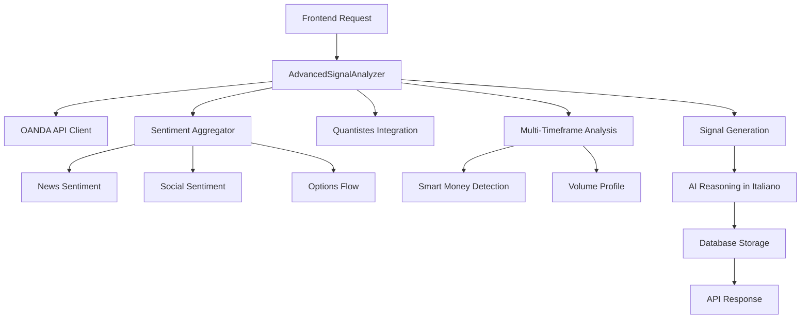

# 📊 Sistema di Generazione Segnali Trading

Questa cartella contiene tutti i file e moduli dedicati alla generazione di segnali di trading per la piattaforma AI Cash-Revolution.

## 🎯 Architettura del Sistema

Il sistema di generazione segnali è basato su **AdvancedSignalAnalyzer** come componente principale, supportato da moduli specializzati per analisi sentiment, integrazione OANDA e enhancement quantitativi.

---

## 📁 Descrizione dei File

### 🔥 **CORE - File Principale**

#### `advanced_signal_analyzer.py` ⭐ **FILE PRINCIPALE**
- **Funzione**: Motore principale per la generazione di segnali trading avanzati
- **Caratteristiche**:
  - Analisi multi-timeframe (M1, M5, M15, H1, H4, D1)  
  - Integrazione sentiment analysis completa
  - Smart money detection e volume profile analysis
  - Calcolo automatico entry/stop-loss/take-profit con ATR
  - Reasoning AI in italiano con dati 0DTE e sentiment
  - Gestione risk/reward ratio ottimizzata
- **Output**: Segnali BUY/SELL con analisi completa e AI reasoning
- **Status**: ✅ ATTIVO - Sistema principale in uso

---

### 📈 **SENTIMENT ANALYSIS - Modulo Completo**

#### `sentiment_analysis/` (Cartella)
Modulo completo v6.0 per analisi sentiment multi-fonte

##### `sentiment_analysis/__init__.py`
- **Funzione**: Inizializzazione modulo sentiment v6.0
- **Exports**: NewsProvider, SocialMediaAnalyzer, OptionsFlowAnalyzer, SentimentAggregator

##### `sentiment_analysis/sentiment_aggregator.py`
- **Funzione**: Aggregatore principale che combina tutte le fonti sentiment
- **Caratteristiche**:
  - Weighted scoring dinamico per strumento
  - Integrazione news + social + options flow
  - Confidence scoring e trading implications
  - Output formattato per AI reasoning
- **Input**: Dati da news, social media, options flow
- **Output**: MarketSentiment aggregato con score e confidence

##### `sentiment_analysis/news_sentiment.py`
- **Funzione**: Analisi sentiment notizie finanziarie in tempo reale
- **Fonti**: Yahoo Finance, Finviz
- **Caratteristiche**:
  - Keywords bullish/bearish per scoring
  - Instrument-specific keyword mapping
  - Relevance scoring per pertinenza notizie
  - Caching per performance
- **Output**: Sentiment news con score -1.0 a +1.0

##### `sentiment_analysis/social_sentiment.py`
- **Funzione**: Analisi sentiment social media (Twitter/X, Reddit)
- **Caratteristiche**:
  - Simulazione post social realistici con engagement
  - Emoji e hashtag analysis
  - Platform-specific sentiment calculation
  - Volume e reach metrics
- **Output**: Sentiment social aggregato per strumento

##### `sentiment_analysis/options_flow.py`
- **Funzione**: Analisi flussi opzioni e unusual activity
- **Caratteristiche**:
  - Calcolo Greeks (Delta, Gamma, Theta, Vega)
  - Unusual activity detection con significance scoring
  - Flow classification (sweeps, blocks, unusual)
  - Premium e volume analysis
- **Output**: Options flow data con significance metrics

---

### 🔌 **INTEGRAZIONE DATI**

#### `oanda_api_client.py`
- **Funzione**: Client ufficiale per OANDA v20 API
- **Caratteristiche**:
  - Connessione sicura a OANDA REST API
  - Fetch candlestick data multi-timeframe
  - Current pricing e spread information
  - Symbol mapping e validation
  - Error handling e rate limiting
- **Status**: ✅ ATTIVO - Fonte dati primaria

#### `quantistes_integration.py` ⭐ **CBOE REAL DATA**
- **Funzione**: Integrazione CBOE ufficiale per analisi quantitative 0DTE
- **Caratteristiche**:
  - **CBOE HTML Scraper**: Parsing reale da quote_table SPX/NDX
  - **Zero-DTE Real Analysis**: Dati autentici da CBOE (no simulazioni)
  - **Gamma Exposure Calculation**: Basato su Open Interest reale
  - **Gemini AI Integration**: Analisi professionale dati reali
  - **Asset-Specific Logic**: Solo indici US supportano opzioni
- **Target**: **SOLO** SPX500_USD, NAS100_USD (US30_USD in sviluppo)
- **Source**: https://www.cboe.com/delayed_quotes/spx/quote_table
- **Status**: ✅ ATTIVO - Dati reali CBOE, no simulazioni

---

### 🏛️ **LEGACY SYSTEM (Non in uso)**

#### `oanda_signal_engine.py` ⚠️ **DEPRECATO**
- **Funzione**: Vecchio engine di generazione segnali con Gemini AI
- **Motivo deprecazione**: Causava inconsistenze con AdvancedSignalAnalyzer
- **Problemi risolti**: 
  - Doppio sistema AI (Gemini + AdvancedSignalAnalyzer)
  - Descrizioni contraddittorie (SELL header vs HOLD description)
  - Mancanza integrazione sentiment
- **Status**: ❌ RIMOSSO dal sistema principale (main.py)

---

### 🧪 **TESTING E DEBUG**

#### `test_local_signal_generation.py`
- **Funzione**: Test locale per AdvancedSignalAnalyzer
- **Caratteristiche**:
  - Verifica inizializzazione sentiment analysis
  - Test symbols problematici (NAS100, SPX500, US30)
  - Debug content verification (0DTE, sentiment presence)
  - Error handling validation
- **Uso**: `python test_local_signal_generation.py`

---

## 🔄 Flusso di Generazione Segnale

## 📋 Status dei Componenti

| Componente | Status | Funzione |
|------------|--------|----------|
| AdvancedSignalAnalyzer | ✅ ATTIVO | Motore principale |
| Sentiment Analysis | ✅ ATTIVO | Analisi sentiment completa |
| OANDA API Client | ✅ ATTIVO | Fonte dati market |
| Quantistes Integration | ✅ ATTIVO | Enhancement indici |
| OANDASignalEngine | ❌ DEPRECATO | Vecchio sistema |

## 🎯 Caratteristiche Principali

### ✅ **Funzionalità Attive**
- **Multi-timeframe analysis** con confluence scoring
- **Sentiment analysis** da news + social + options
- **0DTE options analysis** per **SOLO indici US** (SPX500, NAS100)
- **Smart money detection** con order blocks e FVG
- **AI reasoning** in italiano con dati contestuali
- **Risk management** automatico con ATR
- **Asset-specific logic**: Forex/metalli no opzioni, indici US sì

### 🔧 **Configurazione**
- **API Keys richieste**: OANDA_API_KEY, GEMINI_API_KEY
- **Timeframe supportati**: M1, M5, M15, H1, H4, D1
- **Asset supportati**: 
  - **Forex**: EUR_USD, GBP_USD, USD_JPY, etc. (analisi tecnica + sentiment)
  - **Metalli**: XAU_USD, XAG_USD (analisi tecnica + sentiment)  
  - **Indici US**: SPX500_USD, NAS100_USD (analisi tecnica + sentiment + **0DTE opzioni CBOE**)
  - **Indici EU**: DE30_EUR (analisi tecnica + sentiment)
- **Output**: Segnali BUY/SELL con confidence 60%+

## 🎯 **Logica Asset-Specific**

### **📊 Indici US (SPX500, NAS100)** ⭐ **CON OPZIONI 0DTE**
- ✅ **Dati CBOE Reali**: Parsing HTML da CBOE quote tables
- ✅ **Analisi 0DTE**: Volume, Open Interest, Strikes attivi
- ✅ **Gamma Exposure**: Calcolo da OI concentrations reali
- ✅ **Gemini AI**: Analisi professionale dati autentici
- ✅ **AI Reasoning**: Include riferimenti opzioni, gamma, 0DTE

### **💱 Forex (EUR_USD, GBP_USD, etc.)** - **SENZA OPZIONI**
- ✅ **Analisi Tecnica**: Multi-timeframe, supporti/resistenze
- ✅ **Sentiment Analysis**: News + social media
- ✅ **AI Reasoning**: "Nessuna analisi 0DTE (non applicabile)"
- ❌ **No CBOE**: Mercato spot, non opzioni

### **🥇 Metalli (XAU_USD, XAG_USD)** - **SENZA OPZIONI**  
- ✅ **Analisi Tecnica**: Trend, volume profile
- ✅ **Sentiment Analysis**: News + correlazioni USD
- ✅ **AI Reasoning**: "Nessuna analisi 0DTE (non applicabile)"
- ❌ **No CBOE**: Spot metals, non opzioni

## 📚 **Note di Sviluppo**

- Il sistema usa **SOLO AdvancedSignalAnalyzer** dal commit 389a63a
- **Asset-specific logic** implementata dal commit 6d64f9c
- CBOE integration attiva **SOLO per indici US**
- Forex/metalli: analisi tecnica + sentiment (no opzioni)
- I segnali HOLD sono automaticamente rifiutati (solo BUY/SELL actionable)

---

**Ultimo aggiornamento**: 2025-09-12  
**Versione sistema**: 2.1.0 - Asset-Specific CBOE Integration